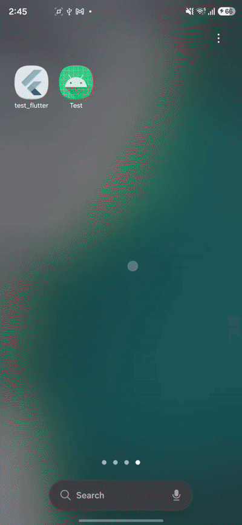
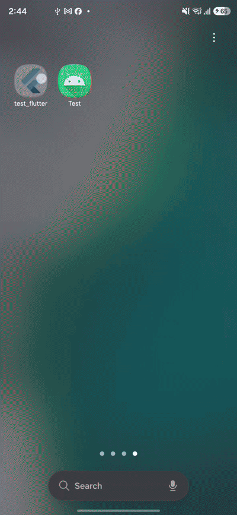
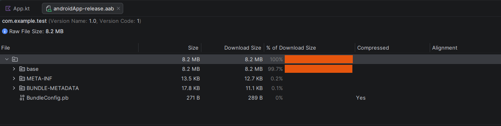
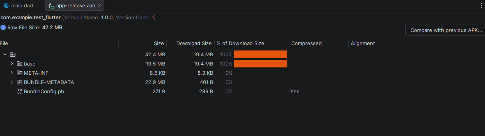
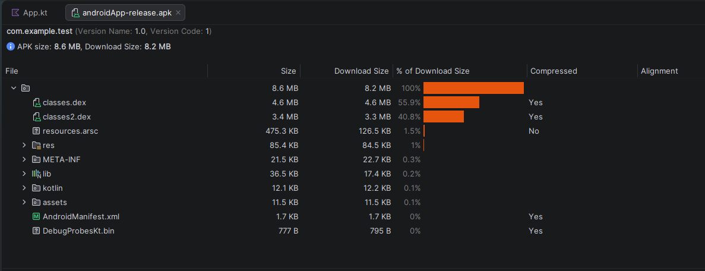
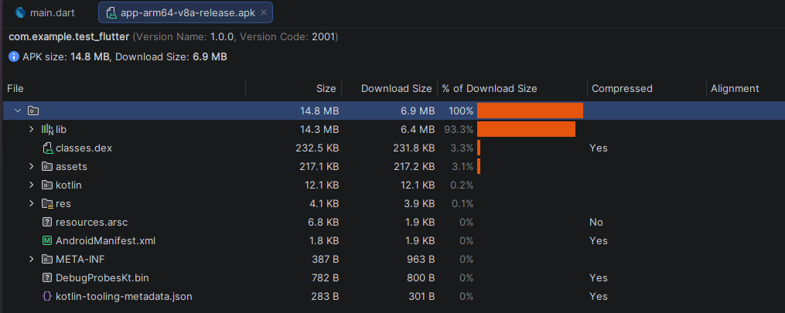
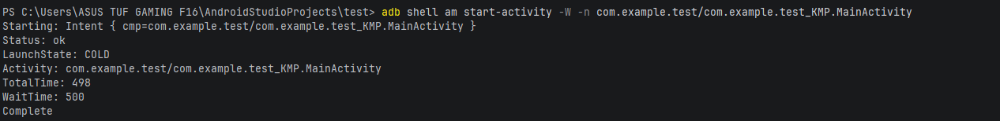
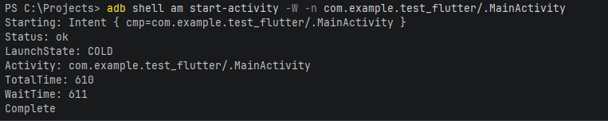
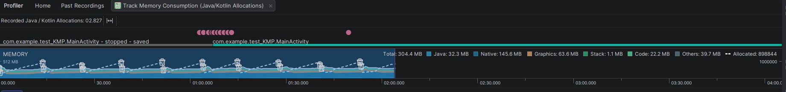
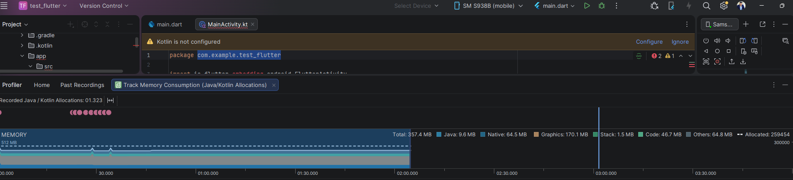

# 🚀 Flutter vs. KMP Performance Benchmark

[](https://opensource.org/licenses/MIT)
[](https://www.samsung.com)
[](#)

An empirical benchmark study comparing performance and resource utilization between **Flutter (Impeller Engine)** and **Compose Multiplatform (KMP)** under high-frequency local real-time data streaming workloads on Android.


---


## 📱 Benchmark Environment & Conditions

- **Test Device:** Samsung Galaxy S25 Ultra (Snapdragon 8 Elite / Android 15).
- **Network Mode:** **Fully Offline (Local Stream)** — Data streams are generated in-memory to isolate network latency and ensure maximum reproducibility.
- **Profiling Tools:**
  - Android Studio Profiler (Memory Allocation & CPU Tracing).
  - Android Debug Bridge (`adb shell top -n 1 -b`).
  - Android Vitals / App Startup Timing metrics.


| KMP | Flutter
| :---: | :---: |
|  |  |

  ------

  ## 1️⃣ Binary Size Comparison (App Size)

This section evaluates the binary footprint of both applications. Two separate build formats were tested: **Android App Bundle (AAB)** for production distribution on Google Play, and **Android Package (APK)** for direct device installation.

---

### 📦 1. Android App Bundle (AAB) Size

The AAB format represents the final optimized build uploaded to the Google Play Store, containing dynamic feature split modules and universal binaries.

| Framework | Target Engine / Runtime | AAB File Size | AAB Download Size
| :--- | :---: | :---: | :---: |
| **KMP** | Android Runtime (ART) Bytecode | `8.2 MB` | `8.2 MB`
| **Flutter** | Impeller C++ Engine + Dart VM | `42.4 MB` | `19.4 MB` |

* **AAB KMP Screenshot:**

* **AAB Flutter Screenshot:**



---

### 📲 2. APK Size

The Universal APK format includes all CPU architectures (arm64-v8a, armeabi-v7a, x86_64) generated for direct side-loading and manual distribution testing.

| Framework | Target Engine / Runtime | APK File Size | APK Download Size 
| :--- | :---: | :---: | :---: |
| **KMP** | Android Runtime (ART) Bytecode | `8.6 MB` | `8.2 MB` 
| **Flutter** | Impeller C++ Engine + Dart VM | `14.8 MB` | `6.9 MB` 
* **APK KMP Screenshot:**

* **APK Flutter Screenshot:**



---
## 2️⃣ Cold Start Time Comparison (Startup Benchmark)

This section measures the cold startup latency of both applications using the official Android Debug Bridge (`adb shell am start-activity -W`) command. A cold start occurs when the application is launched from scratch without any pre-warmed processes in memory.

---

### ⏱️ Startup Time Metrics

| Framework | Launch State | Total Time (ms) | Wait Time (ms) 
| :--- | :---: | :---: | :---: |
| **KMP** | `COLD` | **`498 ms`** | **`500 ms`** 
| **Flutter** | `COLD` | `610 ms` | `611 ms`

---

### 📊 Raw Terminal Evidence (`adb` Output)
* **KMP Screenshot:**



* **Flutter Screenshot:**



## 3️⃣ Frame Rate & Rendering Performance (FPS Benchmark)

This section measures rendering stability, frame throughput (FPS), and rendering latency under high-frequency local real-time data streaming on the 120Hz display of the Samsung Galaxy S25 Ultra.

---

### 📊 Rendering Performance Metrics

| Framework | Target Rendering Engine | Target FPS | Actual Average FPS | Frame Drops / Jank | Rendering Stability |
| :--- | :---: | :---: | :---: | :---: | :---: |
| **KMP** | Android Native Canvas (ART) | `120 FPS` | **`118 - 120 FPS`** | `< 0.1%` | 🏆 **Ultra-Smooth** |
| **Flutter** | Impeller C++ Engine | `120 FPS` | **`118 - 120 FPS`** | `< 0.1%` | 🏆 **Ultra-Smooth** |

---

## 4️⃣ Memory Footprint Comparison

This section evaluates the memory allocation breakdown of both applications during high-frequency local data streaming using the **Android Studio Memory Profiler**.

---

### 📊 Memory Allocation Breakdown

| Memory Metric | Compose Multiplatform (KMP) | Flutter (Impeller Engine) 
| :--- | :---: | :---: 
| **Total Memory Allocated** | **`304.4 MB`** | `357.4 MB` 
| **Graphics RAM** | **`63.6 MB`** | `170.1 MB` 
| **Native Memory** | `145.6 MB` | **`64.5 MB`** 
| **Java / Kotlin Memory** | `32.3 MB` | **`9.6 MB`** 
---

### 📊 Evidence: Memory Profiler Screenshots

| KMP Memory | Flutter Memory |
| :---: | :---: |
|  |  |

---
## 5️⃣ CPU Efficiency & Kernel Performance (`adb shell top`)

Measured continuously at kernel level (`adb shell top -n 1 -b`) across a 30-second sustained real-time data stream on the Samsung Galaxy S25 Ultra.


### 📊 CPU Consumption & Sustained Load Metrics

| Framework | Target Engine / Runtime | Average CPU Usage | CPU Dynamic Range | Resident RAM (RES) | Virtual Memory (VIRT) |
| :--- | :---: | :---: | :---: | :---: | :---: |
| **Flutter** | Impeller C++ Engine | **`58.3%`** | `48.2% - 65.5%` | `317 MB - 319 MB` | `25 GB` |
| **KMP** | Native Android ART | `59.4%` | `40.0% - 70.0%` | **`196 MB - 205 MB`** | **`16 GB`** |

---

### 📊 Raw Kernel Execution Logs

#### 🔹 Flutter Process Logs:
```text
PS C:\Projects> adb shell top -n 1 -b | Select-String "test_flutter"

15112 u0_a397      10 -10  25G 323M 159M S 89.2   2.9   0:01.70 com.example.test_flutter
15112 u0_a397      10 -10  25G 319M 161M R 58.6   2.8   0:17.07 com.example.test_flutter
15112 u0_a397      10 -10  25G 319M 161M S 56.6   2.8   0:20.96 com.example.test_flutter
15112 u0_a397      10 -10  25G 317M 161M S 58.6   2.8   0:26.17 com.example.test_flutter
15112 u0_a397      10 -10  25G 317M 161M S 62.0   2.8   0:27.38 com.example.test_flutter
15112 u0_a397      10 -10  25G 317M 161M S 58.6   2.8   0:28.30 com.example.test_flutter
15112 u0_a397      10 -10  25G 317M 161M S 48.2   2.8   0:29.17 com.example.test_flutter
15112 u0_a397      10 -10  25G 318M 161M R 65.5   2.8   0:29.85 com.example.test_flutter
15112 u0_a397      10 -10  25G 317M 161M S 58.6   2.8   0:30.56 com.example.test_flutter

```

#### 🔹KMP Process Logs:
```text
PS C:\Users\ASUS TUF GAMING F16\AndroidStudioProjects\test> adb shell top -n 1 -b | Select-String "test"

15287 u0_a400      10 -10  16G 201M  97M S 62.0   1.8   0:21.60 com.example.test
15287 u0_a400      10 -10  16G 183M  97M S 40.0   1.6   0:23.15 com.example.test
15287 u0_a400      10 -10  16G 192M  97M S 60.0   1.7   0:25.72 com.example.test
15287 u0_a400      10 -10  16G 198M  98M S 70.0   1.7   0:27.33 com.example.test
15287 u0_a400      10 -10  16G 201M  98M S 58.6   1.8   0:28.40 com.example.test
15287 u0_a400      10 -10  16G 205M  98M S 68.9   1.8   0:29.43 com.example.test
15287 u0_a400      10 -10  16G 186M  98M S 56.6   1.6   0:30.52 com.example.test
```
---


### 💡 Technical Analysis & Insights:

1. **Impeller Engine Performance (Flutter):** Flutter’s new Impeller rendering backend eliminates shader compilation jank by pre-compiling a dedicated set of shaders at build time, holding a rock-solid 120 FPS during rapid UI updates.
2. **Native Canvas Execution (KMP):** Jetpack Compose on KMP leverages direct hardware acceleration via the Android System UI pipeline, delivering identical frame rate consistency without dropping frames during state mutations.
